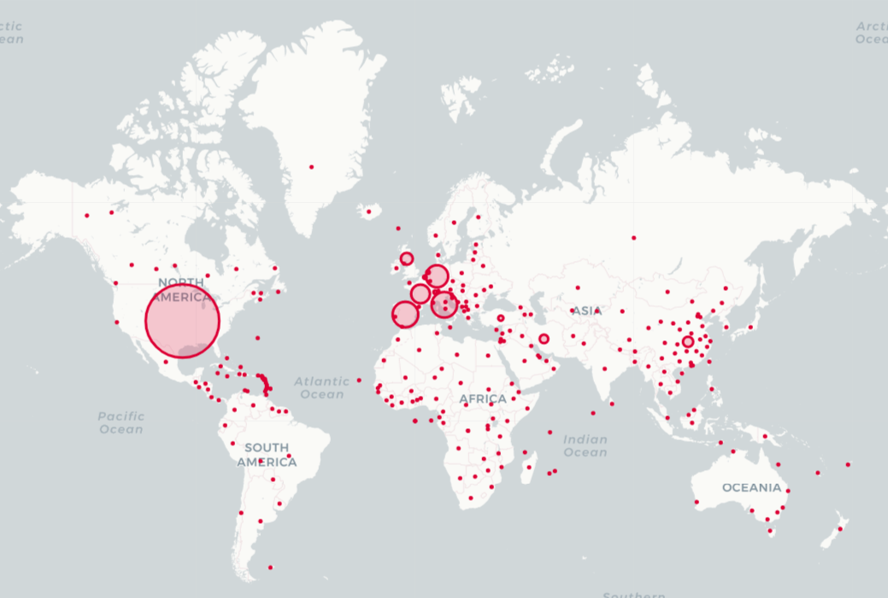

<h1 align="center">
    
</h1>

<h4 align="center">
🦠 <strong>COVID-19 Data Visualization</strong>
</h4>

## ⚙️ Technologies

This project uses these technologies:

<strong> Python 🐍 </strong>  
<strong> Jupyter Notebook 💻 </strong>  
<strong> Libraries 📚 </strong>
- Pandas 🐼
- Numpy 🧊
- Plotly 📈
- Folium 🗺